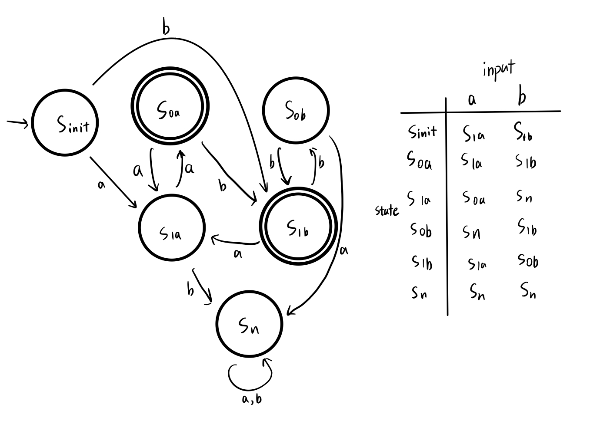
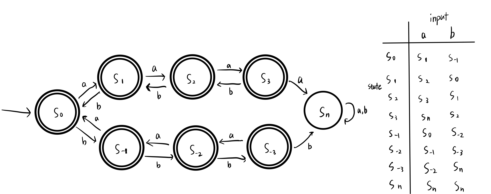

# Homework 1
Name: Yiqiao Jin  
UID: 305107551

## 1

### a

$(B \times B) \times B = \{((0,0),0),((0,1),0),((1,0),0),((1,1),0), ((0,0),1),((0,1),1),((1,0),1),((1,1),1)\}$

### b

$B \times (B \times B) = \{(0,(0,0)),(0,(0,1)),(0,(1,0)),(0,(1,1)), (1,(0,0)),(1,(0,1)), (1,(1,0)),(1,(1,1))\}$

### c

$B \times B \times B = \{(0,0,0),(0,0,1),(0,1,0),(0,1,1), (1,0,0),(1,0,1),(1,1,0),(1,1,1)\}$

### d

$|X| \times |X| = 4 \times 4 = 16$. The power set of $|X| \times |X|$ is the set of all subsets of $|X| \times |X|$. So cardinality $= 2^{16} = 65536$

### e
$\{(\epsilon, a), (a, a), (ac, a), (\epsilon, c), (a, c), (ac, c), (\epsilon, aa), (a, aa), (ac, aa) \}$

## 2

### a

$\{\epsilon, a, ac\} \cdot \{a, c, aa\} = \{a, aa, aca, c, ac, acc, aaa, acaa\}$

Note that '$aa$' can be formed in 2 ways

### b

The result is the empty set $\{\}$

The concatenation of any set with the empty set is the empty set.

### c

$\{\epsilon\} \times \Sigma = \{\epsilon\} \times \{a, b, c\} = \{(\epsilon, a), (\epsilon, b), (\epsilon, c)\}$

### d

The result is the empty set $\{\}$

Similar to (b), there is no element in $\{\}$ that can form new pairs with elements in $L_2^+$.

### e

$\{ \epsilon \} \cdot L_2^+ = L_2^+$

The concatenation of $\{ \epsilon \}$ (the set that only contains the empty string) with $L_2^+$ is the concatention of the empty string with each string in $L_2^+$. Since $\epsilon x = x$ for $x \in L_2$, the resulting set is $L_2^+$. Actually, concatenating $\{ \epsilon \}$ is just an identity operation for language concatenation.

The result does **NOT** contain $\epsilon$. The resulting set can contain $\epsilon$ if and only if $L_2^+$ contains $\epsilon$. Because it is $L_2^+$ and not $L_2^*$, characters in $L_2$ must appear for a positive number of times. We cannot have zero occurrence of $L_2$ in this case. 

## 3

This DFA accepts strings that either:
* Start with 1 followed by an even number of symbols in $\Sigma = \{0, 1\}$, or
* Start with 0 followed by an odd number of symbols in $\Sigma = \{0, 1\}$

## 4

### a
The language $L_{4a}$ is NOT an FSL. To represent the state of the language, we need to design a DFA that both checks the validity of the grammar and the correctness of the sum. The DFA only has a finite memory. However, there are infinitely many possible combinations of $x$ and $y$, and there are infinitely many $z$'s that need to be checked against $x + y$ to ensure that the equality is valid. So the language cannot be represented by a **DFA**, thus NOT an FSL

### b

The language $L_{4b}$ is an FSL. 

Let the DFA $M = (Q, \Sigma, \delta, q_0, F)$, where
* $Q = S_{init}, S_{0a}, S_{1a}, S_{0b}, S_{1b}, S_n$
* $\Sigma = \{a, b\}$
* $\delta$: Transition function is shown as above
* $q_0 = S_{init}$. The start state indicates that we have an even number of $a$'s and $b$'s (zero in this case)
* $F = \{ S_{0a}, S_{1b} \}$: set of accept states

The subscript of a state (e.g. $S_{1a}$) is composed of two parts:
* The number of occurrences of the last word received (0 for even and 1 for odd), and 
* The last word we received (either $a$ or $b$)

Note that $S_n$ is a dead state. We enter this state because we already detect an odd number of $a$'s or an even number of $b$'s in the string, which are unacceptable.

We exclude $\epsilon$ because there is no runs of $a$ and $b$ in the empty string $\epsilon$. Any runs of $w \in \Sigma$ must have length $\ge 1$. Thus, it is not necessary to have $\epsilon$ when we emphasize on the length of runs of $a$ and $b$.

### c
The language $L_{4c}$ is NOT an FSL. The difference between $\#(a, w)$ and $\#(b, w)$ can take an infinite number of values. We need to represent each of those values with a state. Thus, the number of states cannot be finite for this language. 

### d
The language $L_{4d}$ is an FSL. Since we are constraining the difference between $\#(a, y)$ and $\#(b, y)$ on **ALL** prefixes, once we detect $|\#(a, y)-\#(b, y)| \ge 4$, the string $w$ will NOT be accepted. We only need to record 7 values for $\#(a, y)-\#(b, y)$.

Let the DFA $M = (Q, \Sigma, \delta, q_{0}, F)$, where
* $Q = \{S_{-3}, S_{-2}, S_{-1}, S_{0}, S_{1}, S_{2}, S_{3}, S_n \}$. The subscript indicates $\#(a, y)-\#(b, y)$. $S_n$ is the state for unacceptable strings
* $\Sigma = \{a, b\}$
* $\delta$: The transition function simply transitions into a new state with subscript+1 when we receive an $a$, and subscript-1 when we receive a $b$. If $|(a, y)-\#(b, y)| \ge 4$, we transition into $S_n$, the state for unacceptable strings
* $q_{0} = S_0$ indicates the initial empty string
* $F = \{S_{-3}, S_{-2}, S_{-1}, S_{0}, S_{1}, S_{2}, S_{3}\}$

$S_n$ is a dead state. We enter this state because at some point we detect that $|\#(a, y)-\#(b, y)| \ge 4$ which makes the string unacceptable.

## 5

Statement: For all strings $w \in \Sigma$* , if $w = xy$ for some substrings $x, y \in \Sigma$* , then $w^R = y^R x^R$

We can let $w = w_1w_2...w_mw_{m+1}...w_{m+n}$, with $x = w_1w_2...w_m$ and $y = w_{m+1}...w_{m+n}$. Each $w_i \in \Sigma$

#### 5.1 Basis
Prove that the statement $P(1)$ is true for $|x| = 1$ and $|y| = 1$

Let $w = w^1w^2$ with $x = w^1$ and $y = w^2$.

Here, $|w| = 2$. Reversing the string, we get:
* $w^R = w^2w^1$
* $x^R = w^1$
* $y^R = w^2$

$y^Rx^R = w^2w^1 = w^R$. So the base case is proved.

#### 5.2 Inductive Step
Assume the inductive hypothesis $P(n)$ holds for $w, x, y$, where $|x| = m$ and $|y| = n$. According to $P(n)$, $w = xy$, in which
* $w = w_1w_2...w_mw_{m+1}...w_{m+n}$
* $x = w_1w_2...w_m$, and 
* $y = w_{m+1}...w_{m+n}$. 

Each $w_i \in \Sigma$.

We want to prove that $P(n+1)$ holds for $w', x', y'$. We prove this by letting $x' = xa, a \in \Sigma$, and $y' = yb, b \in \Sigma$. $|x'| = m+1$ and $|y'| = n+1$

Thus we get 
* $w' = w_1w_2...w_maw_{m+1}...w_{m+n}b$
* $x' = xa = w_1w_2...w_ma$
* $y' = yb = w_{m+1}...w_{m+n}b$

Reversing the string, we get:
* $w'^R = bw_{m+n}w_{m+1}aw_m...w_2w_1$
* $x'^R = aw_m...w_2w_1$
* $y'^R = bw_{m+n}w_{m+1}$

Indeed, $w'^R = y'^Rx'^R$

Thus the inductive hypothesis is true.

From **5.1-2**, we prove that the theorem is valid.

## 6

Interesting question!

The textbook starts from Chapter 0 Introduction. Each section within chapters is numbered as **Chapter.Section**. The exercises are numbered as **Chapter.Exercise**. The practice problems are attached to the end of each chapters. Figures, examples, and theorems all comprise one sequence within their chapters. So, if there is a figure 1.1, we know that the figure is in chapter one and the next one will be 1.2. Actually I think the syllabus is super helpful when I go through the examples in the book.