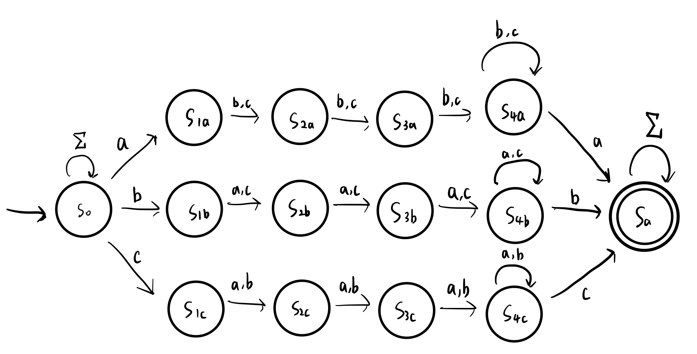

# Homework 2
Name: Yiqiao Jin  
UID: 305107551

### 1

The NFA above recognizes language $L_1$. There are 3 stages for recognizing an input string $w$.

The NFA requires that $w$ contains at least one substring $s$ consisting of 2 of the **same symbol** separated by at least 3 occurrences of the other two symbols. 

We start with the start state $S_0$

In the first stage, we try to identify the start symbol of the substring $s$ for some $s \in \Sigma = \{a, b, c\}$. Here, our design uses nondeterminism to loop on $\Sigma$ before we recognize the start symbol $w_s$. 

In the second stage, after we get the start symbol $w_s$, we transition into either of the 3 states $S_{1a}, S_{1b}, S_{1c}$ with either $a, b, c$ as the start symbol $w_s$. Note that the 3 states are on 3 separate branches. Then, we use three transitions to read the followup 3 symbols in $\Sigma \setminus \{w_s\}$. Since there are $\ge 3$ occurrences of $\Sigma \setminus \{w_s\}$, we stay in $S_{4a}, S_{4b}, S_{4c}$ after reading the symbols. Here, we continue to loop on $\Sigma \setminus \{w_s\}$

In the 3rd stage, we read the last symbol (same as $w_s$) and transition into the accept state $S_a$. Again, our design uses nondeterminism to loop on $S_{accept}$ while reading $\Sigma$.

### 2
We prove that $L_2 = \{ a^{2n}b^n | n \ge 0 \}$ is not regular by contradiction. 

Suppose $L_2$ is an FSL. Let $p$ be the pumping length. So we can choose $s = a^{2n}b^n \in L$. Assume $L_2$ is regular. Here, $s$ can be written as $s = xyz$, the concatenation of some substrings $x, y, z$, where:
1) for each $i \ge 0$, $xy^iz \in A$
2) $|y| = m > 0$ 
3) $|xy| \le p$

We consider 3 cases for the formation of $y$:

#### 2a
The string $y$ consists only of $a$'s. In this case, the number of $a$'s in the string $xyyz$ is more than $2n$, but the number of $b$'s remains the same ($n$). So $xyyz$ is not a member of $L_2$, which violates condition 1 of the Pumping Lemma. This case is a contradiction.

#### 2b

The string $y$ consists only of $b$'s. In this case, the number of $a$'s in the string $xyyz$ remains $2n$. However, the number of $b$'s $> n$. So $xyyz$ is still not a member of $L_2$, which violates condition 1 of the Pumping Lemma.

#### 2c
The string $y$ consists of both $a$'s and $b$'s. In this case, it is possible that within the string $xyyz$, the number of $a$'s is twice the number of $b$'s, specifically, when $y = a^{2m}b^m$ for some $m > 0$). But they will be out of order with some $b$'s before $a$'s. Hence $xyyz$ is still not a member of $L_2$, which is a contradiction.

From 2a-c, we cannot avoid the contradiction if we assume that $L_2$ is regular, so $L_2$ is not regular.

### 3
We prove by contradiction.

$L_3 \cap a^{*}b^{*} = L_2 = \{ a^{2n}b^n | n \ge 0 \}$. Assume $L_3$ is regular. Since $a^{*}b^{*}$ is regular, and regular languages are closed under intersection, the intersection $L_2$ should also be regular.

However, from **2** we know that $L_2 = \{ a^{2n}b^n | n \ge 0 \}$ is NOT regular, a contradiction. Hence $L_3$ is NOT regular

### 4

**Sidenote: I am not sure what it means by "at least one 1 before any #). I assume that patterns like 01### is allowed.**

A regular expression for $L_4$
$$（1\cup \#)^*((0 \cup 1)^*((1)^+\#^*)^* )^*$$

$(1\cup \#)^*$ means that to the left of any $0$'s, we can have any number of $1$ and $\#$.

The $(0\cup 1)^*$ specifies that there can be any number of 0 or 1.

The Kleene Plus '$+$' in $(1)^+\#^*$ ensures that there are at least one 1's before the sequence of '$\#$'. Note that the Kleene Star $*$ of $\#^*$ means that, following an 1, the '$\#$' can appear consecutively for any number of times. This makes patterns like $01\#\#\#$ possible. The Kleene Star $*$ in the outer bracket of $((1)^+\#^*)^*$ means that this pattern $(1)^+\#^*$ is optional (it is possible that $\#$ does not appear at all), but can repeat any number of times in $(0, \infty)$.

The Kleene Star * in the entire expression $((0\cup 1)^*((1)^+\#)^* )^*$ means that this pattern can repeat any number of times in $(0, \infty)$

### 5

I assume the correct statement is: $P(h)$: If $T$ has $k^{h}+1$ leaf nodes, then $T$ must have height at least $h+1$ edges.

To get the maximum number of leaves in a k-ary tree $T$, we should let every parent possess the maximum number of children ($k$ children per internal node). Thus, for each leaf in the *current level* of a tree, there should be $k$ children in its *next level*. This means that the largest number of leaf nodes for height $h$ edges is $k^h$. 

#### 1) Base case 

We try to prove the base case $P(2)$: If $T$ has $k^{2}+1$ leaf nodes, then $T$ must have height at least $2+1=3$ edges.

We start with a max-leaf tree with height of $h=1$ edges. This means the leaf nodes are the immediate children of the root nodes. By definition of a full $k$-ary directed rooted ordered tree, a node can have at most $k$ leaves. So there are at most $k = k^1$ leaves for $h=1$ (note that such tree contains the most leaf nodes for $h=1$).

Similarly, for $h=2$, the root should have exactly k children and each children should have exactly k children. Therefore, the tree can have at most $k^2$ leaves.

According to Pigeon Hole Principle, to derive a $T'$ with $k = k^h + 1 = k^2 + 1$ leaf nodes, we must spawn some new leaf nodes from existing nodes in $T$. So there must exist some edges with height 3.

Therefore, for $h=2$, the base case $P(2)$ is valid.

#### 2) Inductive step

Assume that $T_{h}$ is a full $k$-ary tree of height $h$ that has $k^{h}$ leaf nodes. By definition, it contain the maximum number of leaf nodes among all trees with height $h$. The inductive hypothesis $P(h)$ states that some $T_h'$ (derived from $T_h$) with $k^{h}+1$ leaf nodes must have height of at least $h+1$ edges.

To prove $P(h+1)$, we derive a new $k$-ary tree $T_{h+1}$ with $k^{h+1}$ nodes from $T_h$ by spawning k nodes from each leaf node of $T_h$. $T_{h+1}$ should still be a max-leaf tree, but with height $h+1$. To increase the number of leaf nodes by 1, we must spawn some new leaf nodes from existing nodes in $T_{h+1}$, which will make the height $h+2$. So if some $T_{h+1}'$ has $k^{h+1}+1$ leaf nodes, it must have height of at least $h+2$ edges since some new leaf nodes must be derived from the max-leaf tree.

Therefore, the inductive hypothesis $P(h+1)$ is valid for $h+1$.

From 1-2, we can conclude that the statement is valid.

