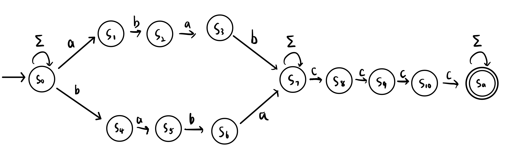
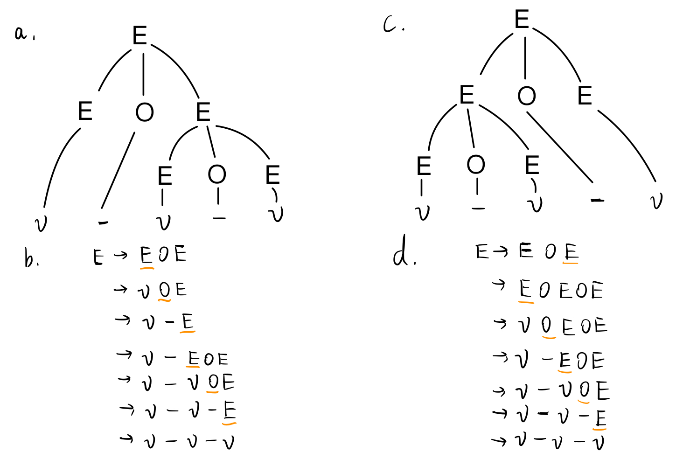

# Homework 3
Name: Yiqiao Jin  
UID: 305107551

### 1
We prove that $L = \{ a^{2n}b^n | n \ge 0 \}$ is not regular by contradiction. 

Suppose $L$ is an FSL. Let $p$ be the pumping length. So we can choose $s = a^{2n}b^n \in L$. Assume $L$ is regular. Here, $s$ can be written as $s = xyz$, the concatenation of some substrings $x, y, z$, where:
1) for each $i \ge 0$, $xy^iz \in A$
2) $|y| = m > 0$ 
3) $|xy| \le p$

We consider 3 cases for the formation of $y$:

#### 1a
The string $y$ consists only of $a$'s. In this case, the number of $a$'s in the string $xyyz$ is more than $2n$, but the number of $b$'s remains the same ($n$). So $xyyz$ is not a member of $L$, which violates condition 1 of the Pumping Lemma. This case is a contradiction.

#### 1b

The string $y$ consists only of $b$'s. In this case, the number of $a$'s in the string $xyyz$ remains $2n$. However, the number of $b$'s $> n$. So $xyyz$ is still not a member of $L$, which violates condition 1 of the Pumping Lemma.

#### 1c
The string $y$ consists of both $a$'s and $b$'s. In this case, it is possible that within the string $xyyz$, the number of $a$'s is twice the number of $b$'s, specifically, when $y = a^{2m}b^m$ for some $m > 0$). But they will be out of order with some $b$'s before $a$'s. Hence $xyyz$ is still not a member of $L$, which is a contradiction.

From 1a-c, we cannot avoid the contradiction if we assume that $L$ is regular, so $L$ is not regular.

### 2

Let $\Sigma = \{a, b, c\}$.

$L_2 = (a(\Sigma)^*(\Sigma \setminus \{a\})) \cup (b(\Sigma)^*(\Sigma \setminus \{b\})) \cup (c(\Sigma)^*(\Sigma \setminus \{c\}))$

The $(\Sigma)^∗$ in the middle requires that the arbitrary symbols between the start symbol and end symbol can appear any times in $[0, \infty)$.

The $a$ at the beginning of the string and $(\Sigma \setminus \{a\})$ at the end of the string require that the start and end symbols are different. The same is true for $b$ and $c$

### 3

The following NFA recognizes $L_3$

The above diagram shows that the NFA recognizes strings with the following pattern:

$\Sigma^* (abab \cup baba) \Sigma^* cccc \Sigma^*$ , where $\Sigma = (a, b, c)$. 

At the beginning of the string, we non-deterministically loop on $\Sigma$ before we detect the start of substring $abab$ (which is $a$) and $baba$ (which is $b$). This means any characters in $(a, b, c)$ are acceptable before we recognize the substring.

We then move onto either of branches representing $abab$ and $baba$ by transition into either $S_1$ or $S_4$. After we continuously read the 4 symbols in the substring and before we read the $cccc$, we non-deterministically loop on $\Sigma$ at $S_7$. Note that substring like $babab$ is acceptable for both branches, and we can transition into either $S_1$ or $S_4$ non-deterministically.

Then, in $S_7$ to $S_{10}$, we try to detect $cccc$. Finally, we transition into the final state $S_a$ and non-deterministically loop on $\Sigma$ since the string has already satisfied all of its requirements.

### 4

### 5

Let $\Sigma = \{b, e, s, ;\}$. Then $L_5$ is specified by the grammar $G$:

$\mathbf{S} \rightarrow b\mathbf{A}e;$  (Rule 1)

$\mathbf{A} \rightarrow b \mathbf{A} e; | s; | \mathbf{A} \mathbf{A}$ (Rule 2)

We use $\mathbf{bold}$ capital letters to represent nonterminal symbols, and lowercase letters to represent terminal symbols.

Rule 1 specifies that every string is generated from the start variable $\mathbf{S}$. It must begin with $b$ and end with $e;$

Rule 2 specifies the rules $\mathbf{A}$ uses to produce substrings. $\mathbf{A}$ can perform either of the following:
* Spawn a new begin-end statement pair, followed by $';'$
* Generate a single statement $s;$ (this is a terminal)
* Generate two statements $\mathbf{A}$ (variables, or nonterminals), separated by $';'$ 

### 6

$G$ is a Context-Free Grammar for the language $L_6$

$\mathbf{S} \rightarrow b\mathbf{A}e$ (Rule 1)

$\mathbf{A} \rightarrow b\mathbf{A}e | s | \mathbf{A}, \mathbf{A}$ (Rule 2)

In Rule 1, the symbol $\mathbf{S}$ is the start variable. This guarantee that all strings generated are enclosed in a pair of beginning and ending symbol $b$ and $e$.

The second rule specifies that every new string spawned by $\mathbf{A}$ can be one of 
* Some string generated by $\mathbf{A}$, enclosed in a begin-end block
* A single statement $s$
* Two new strings generated by $\mathbf{A}$, separated by $','$.

### 7

The string $aaab$ can be accepted by the following ways:

$q_{start} \xrightarrow{a} q_1 \xrightarrow{a} q_2 \xrightarrow{\varepsilon} q_1 \xrightarrow{ab} q_{accept}$

$q_{start} \xrightarrow{\varepsilon} q_2 \xrightarrow{aa} q_1 \xrightarrow{ab} q_{accept}$

(Note: there is a 3rd way):

$q_{start} \xrightarrow{\varepsilon} q_2 \xrightarrow{\varepsilon} q_1 \xrightarrow{aa} q_1 \xrightarrow{ab} q_{accept}$
