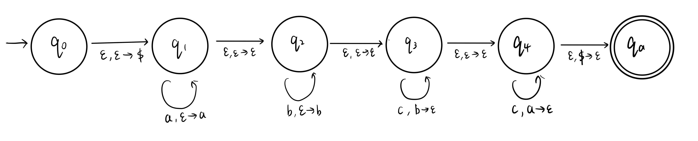

# Homework 5
Name: Yiqiao Jin  
UID: 305107551

### 1

Above is a PDA for the language. The set of stack variables $\Gamma = \{$ \$ $\}$. When we are reading from inputs in $q_1, q_2$, we push $i$ $a$'s onto the stack followed by $j$ $b$'s. Upon reading $c$'s (when we are in $q_3, q_4$), the PDA only accepts the string if it pops exactly $k=i+j$ $c$'s from the stack. The stack variable '\$' we pushed onto the stack when we go from $q_0$ to $q_1$ helps us achieve that - identifying the bottom of the stack. This ensures that the stack is empty when we finish reading all variables in the string, and we do not pop an empty stack when we are still reading inputs.

Note that this PDA also accepts the empty strings $\varepsilon$. This is done by transitioning from $q_1$ all the way to $q_4$ without pushing or poping the stack. Similarly, the PDA also accepts strings with no $a$'s or no $b$'s. 

I also did a CFL for this problem:

$S \rightarrow A$  
$A \rightarrow aAc | B$  
$B \rightarrow bBc | \varepsilon$

$S$ is the start variable.

$A$ is the variable for generating $a$ at the beginning and $c$ at the end of the new string. It guarantees that the number of $a$'s and $c$'s generated are always equal (equal to $i$). $A \rightarrow B$ allows $A$ to stop its generation and pass on to $B$

$B$ is the variable for generating $b$ at the beginning and $c$ at the end of the variable. It guarantees that the number of $b$'s and $c$'s generated are always equal (equal to $j$). $B$ has the option to stop its generation. This is done by $B \rightarrow \varepsilon$

The above two steps ensure that $i+j=k$. The total number of $a$ and $b$ is always equal to that of $c$. It also ensures that the generated string is in the form $a^ib^jc^k$

Note that the empty string can be generated by $S \rightarrow A \rightarrow B \rightarrow \varepsilon$

Example strings that can be accepted by $L_{add}$:
$abcc, abbccc, ac, bc, \varepsilon$

Example strings that CANNOT be accepted by $L_{add}$:

$abc, ab, abccc$

### 2

We assume that $L_2$ is a **CFL** and obtain a contradiction. Let $p$ be the pumping length given by the pumping lemma. We can use the string $s = a^ib^jc^k = a^ib^jc^{i+j}$, where $k = i + j$ and $i > j$ 

According to the pumping lemma for **CFL**, $s$ may be divided into five pieces $s = uvxyz$ satisfying the conditions
1. for each $i \ge 0$, $uv^ixy^iz \in L_2$
2. $|vy| \ge 1$
3. $|vxy| \le p$

Since $|vxy| \le p$, it cannot straddle all three blocks. So when we create $uv^ixy^iz, i \ne 1$, there will always be one unaffected block. That block will have $p$ symbols.

We show that no matter how we divide $s$ into $uvxyz$, one of the three conditions of the lemma is violated. We consider the two cases

#### 1. $v$ or $y$ contains ONLY 1 type of symbol 
There are 3 subcases

##### The $a$'s do not appear
We try pumping up to obtain the string $s' = uv^ixy^iz, i \ge 2$. Within $s'$, the number of $a$'s is still $i$, but it contains more $b$'s and more $c$'s. The number of $b$'s can exceed that of $a$'s, making $i \le j$. Therefore, $s'$ is not a member of $L_2$, and a contradiction occurs.

##### The $b$'s do not appear

In this case, either $a$'s or $c$'s must appear in $v$ or $y$ because they cannot be the empty string at the same time. 

If only one of $a$ or $c$ appears in $v$ and $y$, the sum of $a$'s and $b$'s will NOT match that of $c$'s, i.e. $i+j \ne k$

If both of $a$ or $c$ appear in $v$ and $y$. This only happens when $v$ is formed by $a$'s and $y$ is formed by $c$'s. Pumping down to $s' = uv^0xy^0z$ will make the number of $a$'s less than that of $b$'s, making $i \le j$. So $i \le j$ and it is not in $L_2$.

Either way, a contradiction occurs.

##### The $c$'s do not appear

In this case, if we pump up, the string $s' = uv^ixy^iz, i \ge 2$ will contain more $a$'s or more $b$'s. The total number of $a$'s and $b$'s, which is the sum of $i+j$, will exceed $k$. So $s'$ is not in $L_2$, and a contradiction occurs.

#### $v$ or $y$ contains $\ge 1$ type of symbols
In this case, $s' = uv^ixy^iz, i \ge 2$ may contain equal numbers of the three alphabet symbols, but the symbols will NOT be in the correct order. Hence it cannot be a member of $L_2$, which is a contradiction.

Therefore, we prove that $L_2$ is NOT a **CFL**.

### 3

We can design two DFA's for accepting A and B: 

$D_A = (P, \Sigma, \delta_A, q_A, F_A)$

$D_B = (Q, \Sigma, \delta_B, q_B, F_B)$

The new DFA is given by $D = (S, \Sigma, \delta, q, F)$, where

1. $S = P \times Q \times \{p_A,p_B\}$: The new set of states is the product of the two set of states and a binary symbol in $\{p_A,p_B\}$. The last symbol indicates whether the next symbol received is from $A$ or from $B$.
2. $\Sigma$: The Alphabet remains the same
3. $q_0 = (q_A, q_B, p_A)$: The start state is a 3-tuple formed by the start states of $A$ and $B$, as well as a binary symbol in $\{p_A,p_B\}$ indicating whether the next symbol is from $A$ or from $B$. The last symbol $q_A$ means that our accepted string $w$ starts with a symbol in $A$, which is $a_1$
4. $\delta$: The new Transition Function. It handles two cases since the next symbol received can be from either $A$ or $B$. Assume that currently $D_A$ is in state $s_A$ and $D_B$ is in state $s_B$. 
   1. When the next symbol $a_i$ received by $D$ is from $A$, $\delta((s_A, s_B, p_A), a_i) = (\delta_A(s_A, a_i), s_B, p_B)$. Here, $\delta_A(s_A, a_i)$ is the new state $D_A$ transitions into upon receiving $a_i \in A$. Now the next symbol is from $B$, so the trailing binary symbol of the new state tuple turns into $p_B$
   2. Similarly, $\delta((s_A, s_B, p_B), b_j) = (s_A, \delta_B(s_B, b_j), p_A)$. The next symbol is from $A$, so the trailing binary symbol of the new state tuple turns into $p_A$
5. $F = F_A \cup F_B \cup \{ p_A \}$. This is the new set of Accept States. The trailing binary symbol is always $p_A$ because $b_k$, the last symbol received by the language, is in $B$. 

Since the new DFA $D$ accepts the **perfect shuffle** of any two strings (with the same length) from regular languages $A$ and $B$, the class of regular languages is closed under **perfect shuffle**.
