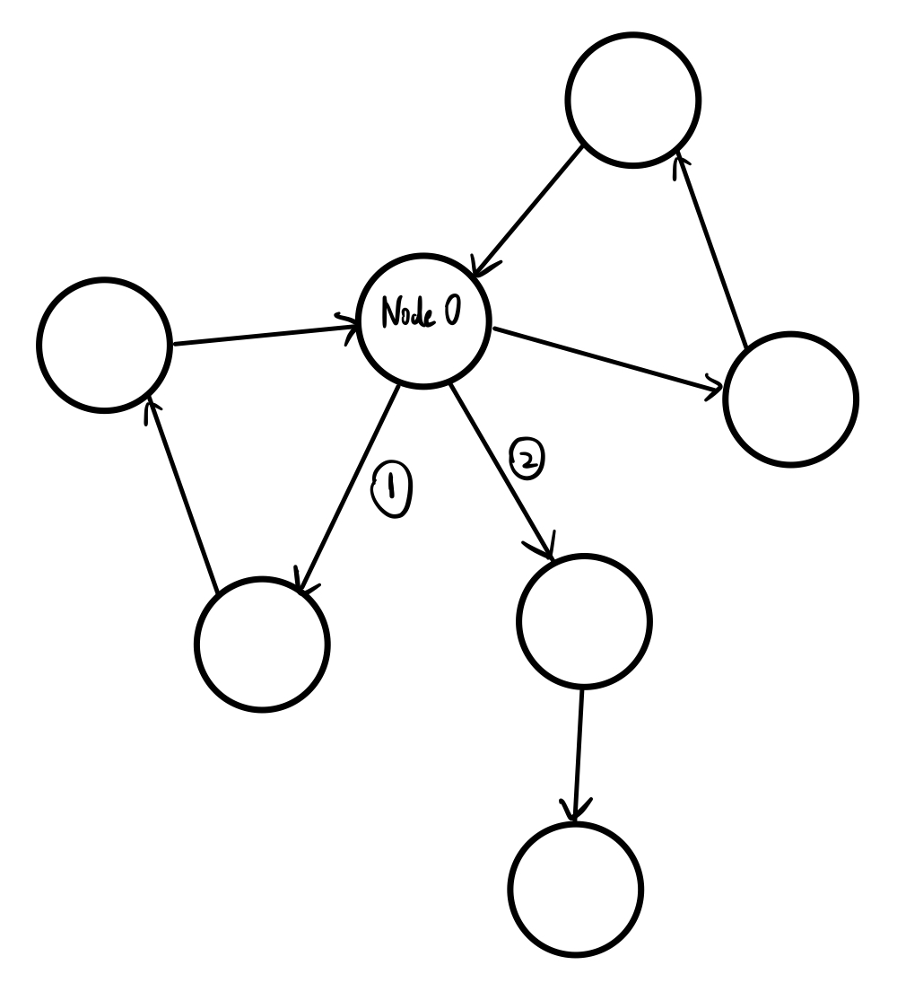
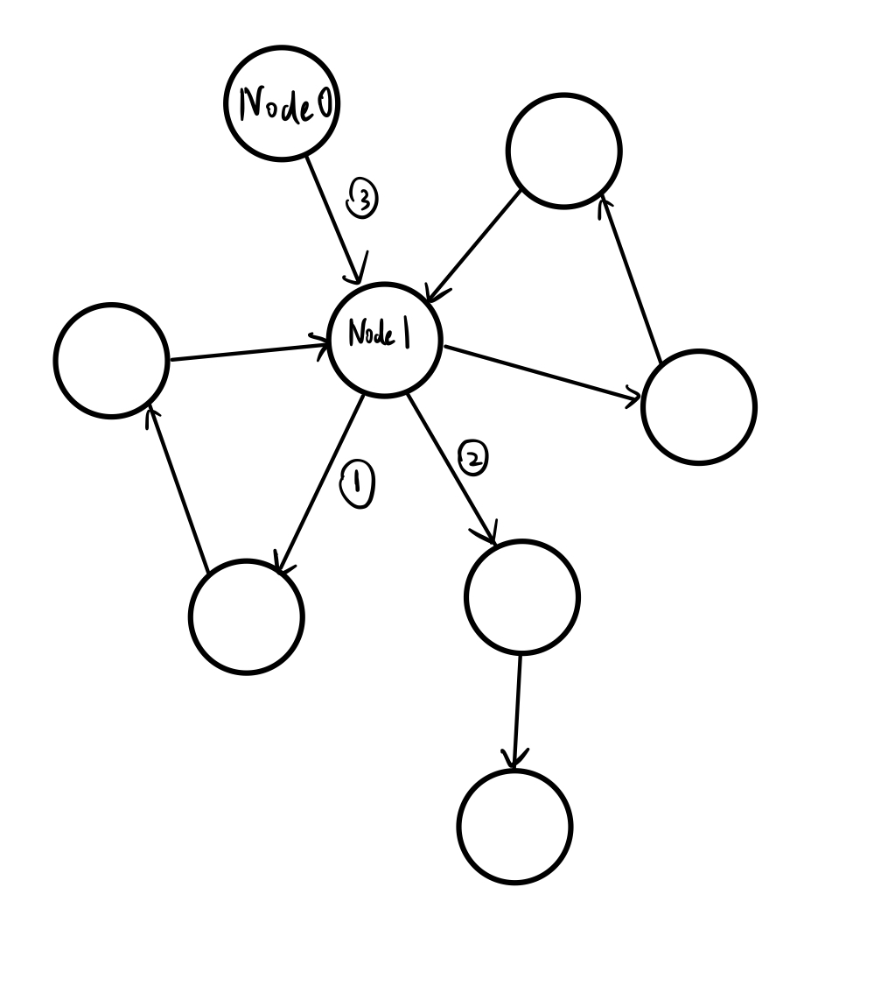

# Homework 7
Name: Yiqiao Jin  
UID: 305107551

### 1

#### a
The grammar is ambiguous. The string $ac$ can be derived in two different ways using this grammar:

$S \rightarrow P \rightarrow ac$

$S \rightarrow P \rightarrow a\underline{S}c \rightarrow a \varepsilon c \rightarrow ac$

Similarly, the string $bd$ can also be derived in two different ways:

$S \rightarrow B \rightarrow bd$

$S \rightarrow P \rightarrow b\underline{S}d \rightarrow b\varepsilon d \rightarrow bd$

So this grammar is ambiguous.

#### b

The ambiguity is partly due to the rule $S \rightarrow \varepsilon$, which means we can either generate a variable or not. Rule 1 provides a way to go from $S$ to $P, B$, and Rule 2-3 provide ways to to go from $P, B$ back to $S$. So the left-hand-side variable $S$ is not always used as the start variable. This couples with the rule $P \rightarrow a S c | a c$ and becomes a repetition.

We can find two different reduction for the same reduction string $acbd$ due to this rule.

$\underline{ac}bd \mapsto \underline{a \varepsilon c}bd \mapsto P\underline{bd} \mapsto \underline{P}B  \mapsto S\underline{B} \mapsto \underline{SS} \mapsto S$ 

$\underline{ac}bd \mapsto P\underline{bd} \mapsto \underline{P}B  \mapsto S\underline{B} \mapsto \underline{SS} \mapsto S$ 

<!-- , which allows a variable to generate an infinite number of itself in several different orders.  -->

<!-- We can find two different reduction for the same reduction string $acacbd$ due to this rule.

$\underline{ac}acbd \mapsto S\underline{ac}bd \mapsto SS\underline{bd} \mapsto \underline{SS}S \mapsto \underline{SS} \mapsto S$ 

$\underline{ac}acbd \mapsto S\underline{ac}bd \mapsto SS\underline{bd} \mapsto S\underline{SS} \mapsto \underline{SS} \mapsto S$  -->

#### c

We can convert the grammar to Chomsky normal form by using the following conversion procedure

##### 1. Make a new start variable

$$
S_0 \rightarrow S \\
S \rightarrow S S|P| B | \varepsilon \\
P \rightarrow a S c | a c \\
B \rightarrow b S d | b d \\
$$

##### 2. Remove $\varepsilon$ rules, where LHS is NOT the start variable

$$
S_0 \rightarrow S | \varepsilon \\
S \rightarrow S S | P | B \\
P \rightarrow a S c | a c \\
B \rightarrow b S d | b d \\
$$

##### 3a. Remove unit rules $S \rightarrow P$, $S \rightarrow B$

$$
S_0 \rightarrow S | \varepsilon \\
S \rightarrow S S | a S c | a c | b S d | b d \\
P \rightarrow a S c | a c \\
B \rightarrow b S d | b d \\
$$

Since $P, B$ are no longer used, we can remove them.

$$
S_0 \rightarrow S | \varepsilon \\
S \rightarrow S S | a S c | a c | b S d | b d \\
$$

##### 3b. Remove $S_0 \rightarrow S$

$$
S_0 \rightarrow S S | a S c | a c | b S d | b d | \varepsilon \\
S \rightarrow S S | a S c | a c | b S d | b d \\
$$

#### 4. Replace rules with the form $U \rightarrow a$

$$
S_0 \rightarrow S S | U_a S U_c | U_a U_c | U_b S U_d | U_b U_d | \varepsilon \\
S \rightarrow S S | U_a S U_c | U_a U_c | U_b S U_d | U_b U_d \\
U_a \rightarrow a \\
U_b \rightarrow b \\
U_c \rightarrow c \\
U_d \rightarrow d \\
$$

#### 5. Convert 3-variable rules to 2-variable rules

$$
S_0 \rightarrow S S | V_a U_c | U_a U_c | V_b U_d | U_b U_d | \varepsilon \\
S \rightarrow S S | V_a U_c | U_a U_c | V_b U_d | U_b U_d \\
V_a \rightarrow U_a S \\
V_b \rightarrow U_b S \\
U_a \rightarrow a \\
U_b \rightarrow b \\
U_c \rightarrow c \\
U_d \rightarrow d \\
$$

Since the grammar is in Chomsky normal form, the grammar is now unambiguous.

Another simpler but unambiguous grammar would be:

$$
S \rightarrow P S | B S | \varepsilon\\
P \rightarrow a S c\\
B \rightarrow b S d\\
$$

This grammar is unambiguous because it only allows generation of $P, B$ with tail recursion. It also removes the cyclic generation given by Rule 2 ($P \rightarrow a S c | a c$) and Rule 3, as in **a**.

### 2

#### a
$C0$ does not correctly recognize the language. In this grammar, we are looking for directed cycles that contains $Node0$. However, $C0$ only looks at the first outgoing edge for each node, and the choice of the first edge can be arbitrary. This is equivalent to DFS along just a single path and the string is rejected if the path fails. Essentially we need some ways to keep track of the edges we have visited and see which edges we have not visited.

In the following example, as $C0$ starts at $Node0$, it may fail to choose edge 1 as its next edge, and directly go on edge 2 and reject the graph.

#### b
This is a **procedure** because it can fall into infinite loops. **Procedures** are Turing Machines that can fall into infinite loops, whereas **Algorithms** are **TM**'s which halt (and accept / reject) for all inputs. We have cycle in the graph $G$. Since $Node0$ is not necessarily the node that is involved in the loop, and $C0$ does NOT keep track of all the edges it has visited, it is possible for $C0$ to go on the same loop by visiting the same set of nodes several times. 

In this example, $C0$ can start on $Node0$, go on edge 3 and land in some $Node1$ which is involved in a loop (for example, the loop that start with edge 1 in the figure), and go on this loop, eventually go back to $Node1$, and go on the same loop for the 2nd time and so on. $C0$ never halts because every node on this loop is NOT $Node0$ and has at least 1 outgoing edge, and $C0$ may choose the node involved in this loop as $NextNode$ every time. 

### 3

Below is a grammar for the language. Let $G = (V, \Sigma, R, S)$ be a CFG, where $\Sigma = \{ a, b\}, V = \{ S, A, B, C, D\}$

$$
S \rightarrow aAa | aBb | bCa | bDb \\
A \rightarrow aAa | aBb | bAa | bBb \\
B \rightarrow aBa | bBa | \varepsilon \\
C \rightarrow aAa | aBb | bCa | bDb \\
D \rightarrow aBa | bDa \\
$$

All of these variables generate 2 symbols at a time, so the length is guaranteed to be even. Also, the shortest string that can be generated by this grammar is $ab$.

$S$ is the start variable. It generates strings that contain variables $\{ A, B, C, D\}$. Each of these variables describes the specific requirements the string has satisfied.

$A$ means that
* the first part of the string $s$ already contains an $a$, BUT 
* the second part does NOT have $b$'s yet.

Thus we can continue generate either $a$ or $b$ in both first half and second half of the string.

$B$ means that
* the first part of the string $s$ already contains an $a$, AND 
* the second part already contains a $b$

This means that conditions on both first part and second part of the string $s$ have been temporarily satisfied. Now only more $a$'s but no more $b$'s are allowed in the second part. The first part can contain more $a$ and $b$. 

Note that $B$ can yield $\varepsilon$ because it satisfies restrictions on both 1st and 2nd part of the string, thus can terminate its generation.

$C$ means that
* the first part of the string $s$ does NOT contain an $a$, AND
* the second part does NOT contain $b$

This means that conditions on neither first part or second part of the string $s$ has been temporarily satisfied. Thus we can generate either $a$ or $b$ in both first half and second half of the string.

$D$ means that
* the first part of the string $s$ does NOT contain an $a$, BUT 
* the second part already contains a $b$

This means we need to generate $a$ in the first part of the string. Also, only $a$'s but not $b$'s are allowed in the second part.

Example strings that can be accepted by $L$:
$aaba, ab, baab$

Example strings that CANNOT be accepted by $L$:
$b, \varepsilon, aabb, bb$
