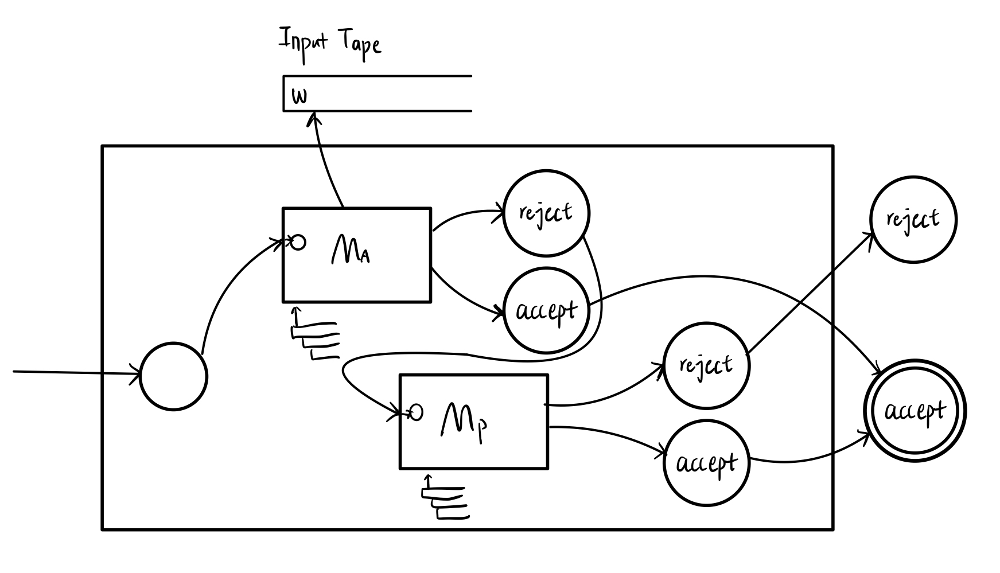

# Homework 8
Name: Yiqiao Jin  
UID: 305107551

### 1

The grammar is ambiguous. The string $baabba$ can be reduced in two different ways using this grammar:

$\underline{b}aabba \mapsto B\underline{a}abba \mapsto BA\underline{a}bba \mapsto B\underline{AA}bba \mapsto \underline{BC}bba \mapsto A\underline{b}ba \mapsto AB\underline{b}a \mapsto ABB\underline{a} \mapsto AB\underline{BA} \mapsto A\underline{BS} \mapsto \underline{AB} \mapsto S$

$\underline{b}aabba \mapsto B\underline{a}abba \mapsto BA\underline{a}bba \mapsto BAA\underline{b}ba \mapsto BA\underline{AB}ba \mapsto B\underline{AS}ba  \mapsto BA\underline{b}a \mapsto BAB\underline{a} \mapsto BA\underline{BA} \mapsto B\underline{AS} \mapsto \underline{BA} \mapsto S$

There are more than 2 possible reductions. For example, a slightly modified version of 1 gives:

$\underline{b}aabba \mapsto B\underline{a}abba \mapsto BA\underline{a}bba \mapsto B\underline{AA}bba \mapsto \underline{BC}bba \mapsto A\underline{b}ba \mapsto AB\underline{b}a \mapsto A\underline{BB}a \mapsto \underline{AD}a \mapsto B\underline{a} \mapsto \underline{BA} \mapsto S$

### 2

#### a

Let $M_A$ be a TM decider for $L_A$ (Recursive language). Let $M_P$ be a TM recognizer for $L_P$ (R.E. language). 

We can construct a **Universal Turing Machine** $M$ for the union of languages $L_P \cup L_A$. 

We use the $M$ to simulate $M_A$ on a given input string $w$ for $L_A$:
* If $M_A$ halts and accepts, $M$ halts and accepts
* If $M_A$ halts and rejects, we use $M$ to simulate $M_P$ on $w$

Note that, since $M_A$ is a decider, it must always halt on its input (instead of entering infinite loops), and either accept or reject.

Similarly, we can use $M$ to simulate $M_P$ on a given input string $w$ for $L_P$:

* If $M_P$ halts and accepts, $M$ halts and accepts
* If $M_P$ halts and rejects, $M$ halts and rejects
* If $M_P$ does not halt, this means the input string cannot be accepted. So $M$ does not halt, either. It continuously runs as $M_P$ does.

This way, $M$ may fail to halt on some inputs in $L_P \cup L_A$. This means $L_P \cup L_A$ is Recursively Enumerable.

A picture for this **Universal Turing Machine**:

#### b

In order to decide whether $w$ is in $L_P \cup L_A$, we need to let $M$ simulate $M_P$ in cases that $w$ is not in $L_A$ in our first step, which means that it can receive any strings as $M_P$ receives. However, $L_P$ is Recursively Enumerable but not necessarily Recursive. This means $M_P$ does not always halt on its inputs and can only **recognize** (instead of **decide**) strings that belong to $L_P$. Similarly, $M$ may not halt on its inputs. So $M$ is a Turing Machine Procedure (but not an Algorithm) that recognizes the union $L_P \cup L_A$ .
